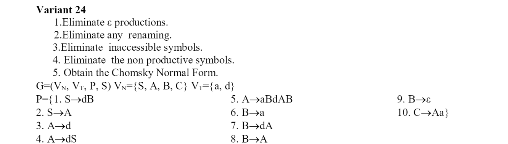

# LFAF
>Racovcena Irina, FAF-212

### Variant 24
### Lab1
```
VN={S, A, C, D},
VT={a, b}, 
P={ 
    S → aA     
    A → bS    
    A → bD   
    D → bC    
    C → a   
    C → bA   
    D → aD
}
```
### Lab2

```
Q = {q0,q1,q2},
∑ = {a,b},
F = {q2},
δ(q0,b) = q0,
δ(q0,b) = q1,
δ(q1,b) = q2,
δ(q0,a) = q0,
δ(q2,a) = q2,
δ(q1,a) = q1.
```

### Lab4
