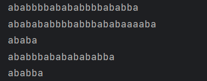
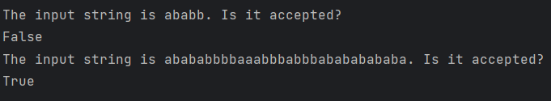

# Topic: Intro to formal languages. Regular grammars. Finite Automata.
## Course: Formal Languages & Finite Automata
### Author: Racovcena Irina
____
## Theory
Components of a language are:
* The alphabet
* The vocabulary
* The grammar

A **grammar** G is an ordered tuple such as G = (VN, VT, P, S)
where:
* Vn is a finite set of non-terminal symbols
* Vt is a finite set of terminal symbols
* S is a start symbol
* P is a finite set of productions of rules

Using the productions(rules), we can generate words of a language.
For instance, we'll take:
```
VN={S, A, C, D}
VT={a, b},
P={
S → aA     
A → bS    
A → bD   
D → bC    
C → a   
C → bA   
D → aD
}
```
The generated word will be:
`S -> aA -> abD -> abbC -> abba`

**Finite Automaton**

A finite automaton is used to recognize patterns within input taken from alphabet. The job of an FA is to accept or reject an input depending on whether the pattern defined by the FA occurs in the input.
- Q is a finite set of states.
- Σ is an input alphabet.
- δ: Q × Σ → Q is a transition function.
- q0 is the initial state.
- F is a set of accepting states (or final states).


## Objectives:
a. Implement a type/class for your grammar;

b. Add one function that would generate 5 valid strings from the language expressed by your given grammar;

c. Implement some functionality that would convert and object of type Grammar to one of type Finite Automaton;

d. For the Finite Automaton, please add a method that checks if an input string can be obtained via the state transition from it;

## Implementation description
1. Implementing a type/class for your grammar
In order to do this task, I simply had to take in consideration the theory mentioned before, so the `Grammar` class will look like this:
```
class Grammar:
    def init(self, startSymbol, nonTerminal, terminals,
                 productions, final):
        self.startSymbol = startSymbol
        self.terminals = terminals
        self.nonTerminal = nonTerminal
        self.productions = productions
        self.final = final
```
2.  Adding one function that would generate 5 valid strings from the language expressed by the given grammar
```
    def generateString(self, symbol: str) -> str:
        string = ''
        if symbol not in self.terminals:
            index = self.productions[symbol]
            chooseVn = random.choice(index)
            for i in chooseVn:
                string += self.generateString(i)
            return string
        else:
            return symbol

    def printString(self) -> str:
        return self.generateString(self.startSymbol)
```
The first method, `generateString()`, takes a symbol as input and returns a string of characters by recursively selecting a random production rule for non-terminal symbols until only terminal symbols remain.

The second method, `printString()`, simply calls `generateString` with the start symbol as input and returns the resulting string.


3. Implementing a method that would convert an object of type Grammar to one of type Finite Automaton

For every regular grammar can be obtained equivalent finite
automaton. So, there will be:

```
G(Vn, Vt, P, S) => (Q, Σ, δ, q0, F) 
Q = Vn
Σ = Vt
q0 = S
δ = P
```
Firstly, I made a method to convert productions to transitions:
```
    def PtoT(self):
        transition = {}

        for non_terminal, productions in self.productions.items():
            transitions = {}
            for production in productions:
                if len(production) == 1:
                    transitions[production] = 'a'
                elif production[0] not in transitions:
                    transitions[production[0]] = [production[1]]
                else:
                    transitions[production[0]].append(production[1])
            transition[non_terminal] = transitions
        return transition
```
The method iterates over each non-terminal symbol in the grammar's set of productions, and for each non-terminal symbol, it generates a dictionary of possible transitions. The keys in the dictionary are symbols that could follow the non-terminal in a derivation, and the values are lists of symbols that could come after the key symbol in the same derivation.

Next, I used this method in order to convert Grammar to Finite Automata:

```
       def toFA(self):
            alphabet = set(self.terminals)
            states = self.nonTerminal
            transitions = self.PtoT()
            start_state = 'S'
            final_state = {'a'}
            finite_automaton = FiniteAutomaton(alphabet, states, start_state, transitions, final_state)
            return finite_automaton
```
4. Adding a method that checks if an input string can be obtained via the state transition from it
```    
    def accept(self, input_string: str) -> bool:
        states = [self.start_state]
        for char in input_string:
            next_states = []
            for state in states:
                if state in self.transitions and char in self.transitions[state]:
                    next_states.extend(self.transitions[state][char])
            if not next_states:
                return False
            states = next_states
        return any(state in self.final_states for state in states)
```

This method takes an input string that has to be checked. 
It then iterates over each character in the input string and 
generates a new list called `next_states`. For each state in the 
states list, the method checks if there is a transition from 
that state on the current character. If there is a transition, 
the method adds the next states to `the next_states` list. 
If there are no next states for the current character, 
the input string cannot be accepted, and the method 
returns `False`. Otherwise, the states list is updated to 
the `next_states` list for the next iteration.
After processing all characters in the input string, 
the method returns `True` if the current state is a final state.

```
fa = grammar.toFA()

input_string1 = 'ababb'
print('The input string is ' + input_string1 + '. Is it accepted?')
print(fa.accept(input_string1))  # Output: False

input_string2 = 'abababbbbaaabbbabbbabababababa'
print('The input string is ' + input_string2 + '. Is it accepted?')
print(fa.accept(input_string2))  # Output: True
```


## Conclusion
In this laboratory work I have studied what is a formal language, Grammar
and Finite Automata. The received tasks were managed to apply theoretical considerations in practice.
Knowledge on Formal Languages is essential in computer science, that's why this
laboratory work was useful.

### Results:

Generating 5 strings method:



Checking if an input string can be obtained via the state transition from it:




## References:
https://else.fcim.utm.md/pluginfile.php/110458/mod_resource/content/0/LFPC_Guide.pdf
