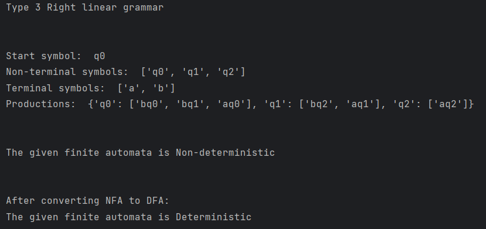
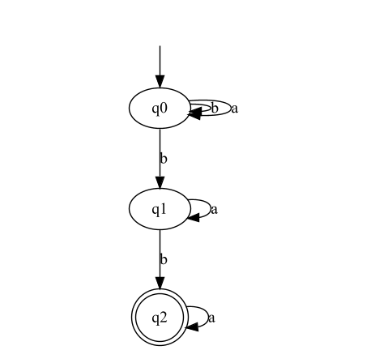
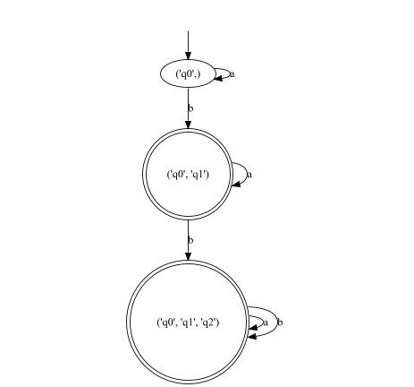

# Topic: Intro to formal languages. Regular grammars. Finite Automata.
## Course: Formal Languages & Finite Automata
### Author: Racovcena Irina
### Variant: 24
____
## Theory Notations
**Chomsky Classification**

According to Noam Chomsky, there are four types of grammars − Type 0, 
Type 1, Type 2, and Type 3.

* Recursively enumerable grammars –recognizable by a Turing machine
* Context-sensitive grammars –recognizable by the linear bounded automaton
* Context-free grammars - recognizable by the pushdown automaton
* Regular grammars –recognizable by the finite state automaton
 

Finite Automaton can be classified into two types −

* Deterministic Finite Automaton (DFA)
* Non-deterministic Finite Automaton (NDFA / NFA)

**Deterministic Finite Automata (DFA)**

It's finite automata with deterministic behavior. 
In DFA, there is exactly one transition from any state 
of finite automata for each input symbol. It accepts the string by halting at a final state, and it rejects it by halting at a non-final state.

**Non-deterministic Finite Automata (NDFA/NFA)**

It's a finite automata that isn't deterministic. 
In NFA, there are zero or more transitions from any state 
of finite automata for each input symbol. It accepts the string by halting in a final state, and it rejects the string by halting in a non-final state or in a dead configuration.

## Objectives:
1. Understand what an automaton is and what it can be used for.


2. Continuing the work in the same repository and the same project, the following need to be added: a. Provide a function in your grammar type/class that could classify the grammar based on Chomsky hierarchy. 

    b. For this you can use the variant from the previous lab.


3. According to your variant number (by universal convention it is register ID), get the finite automaton definition and do the following tasks:

    a. Implement conversion of a finite automaton to a regular grammar.
    
    b. Determine whether your FA is deterministic or non-deterministic.
    
    c. Implement some functionality that would convert an NDFA to a DFA.
    
    d. Represent the finite automaton graphically (Optional, and can be considered as a bonus point):
    
    * You can use external libraries, tools or APIs to generate the figures/diagrams.
    
    * Your program needs to gather and send the data about the automaton and the lib/tool/API return the visual representation.

## Implementation description
1. Chomsky Classification

**Type 3** is the most restricted one, therefore, I started with it first.]
It must have a single non-terminal on the left-hand side and a right-hand side consisting of a single terminal 
or single terminal followed by a single non-terminal.

There are 2 forms of Regular Grammar: Left Linear and Right Linear. They have
the following allowed forms:
```
  Right linear grammar:
  A → aB
  A → a
  
  Left linear grammar:
  A → Ba
  A → a
```

**Type 2** productions must be in the form A → γ where A ∈ N (Non terminal)
and γ ∈ (T ∪ N)* (String of terminals and non-terminals).

**Type 1** productions must be in the form  α A β → α γ β 
where A ∈ N (Non-terminal)
and α, β, γ ∈ (T ∪ N)* (Strings of terminals and non-terminals).
The strings α and β may be empty, but γ must be non-empty.

**Type 0** productions have no restrictions. 

So, I put restraints foк each of the types and here's how I implemented all these conditions in code:
```
    def Chomsky(self):
        type1 = True
        type2 = True
        type3_right = True
        type3_left = True

        for non_terminal in self.nonTerminal:
            for production in self.productions[non_terminal]:
                if (len(production) == 2 and production[1] not in self.nonTerminal and
                    production[0] not in self.terminals) \
                        or len(production) > 2:
                    type3_right = False
                    break

                if (len(production) == 1 and production[0] not in self.terminals) \
                        or (len(production) == 2 and production[0] not in self.nonTerminal) \
                        or len(production) > 2:
                    type3_left = False
                    break

                if any(len(lst) > 2 for lst in production) or any(len(lst) == 0 for lst in production):
                    type2 = False
                    break

                if len(production) == 0:
                    type1 = False
                    break

        for production in self.productions.keys():
            if len(production) != 1:
                type2 = False
                break

            if all(len(p) < 1 for p in production):
                type1 = False
                break

        if type3_right:
            return 'Type 3 Right linear grammar'
        elif type3_left:
            return 'Type 3 Left linear grammar'
        elif type2:
            return 'Type 2'
        elif type1:
            return 'Type 1'
        else:
            return 'Type 0'
```

2. Conversion of a finite automaton to a regular grammar

The process of converting a finite automaton to a regular grammar is 
similar to the one we did in the previous laboratory work. So, the approach to converting 
finite automaton to regular grammar is opposite. We just had to iterate over the transitions and final 
states of the automaton and construct the productions for each non-terminal symbol in the grammar.

```
    def convert(self):
        non_terminals = self.states
        terminals = self.alphabet
        productions = {}
        start_symbol = self.start_state

        for s1, a, s2 in self.transitions:
            if s1 not in productions:
                productions[s1] = []
            productions[s1].append(a + s2)

        for state in self.final_states:
            if state not in productions:
                productions[state] = []

        return Grammar(start_symbol, non_terminals, terminals, productions, self.final_states)                
```

3. Determining whether the given FA is deterministic or non-deterministic

As mentioned before, for each symbolic representation of the alphabet, 
there is only one state transition in DFA. Moreover, in NFA, each pair of state and input 
symbol can have many possible next states. But in DFA, the next possible state is distinctly set.

The function that is provided below checks whether there is more than one possible 
next state for any combination of state and input symbol 
in the transitions dictionary. If there is, this means 
that the automaton is nondeterministic, since there are 
multiple possible transitions from a given state with a 
given input symbol. In this case, the function returns False. 
Otherwise, if there is only one possible next state for each 
combination of state and input symbol, the automaton is deterministic, 
and the function returns True.

```
    def is_deterministic(fa):
        transitions = defaultdict(set)

        for transition in fa.transitions:
            state, symbol, next_state = transition
            transitions[(state, symbol)].add(next_state)

        for (state, symbol) in transitions:
            if len(transitions[(state, symbol)]) > 1:
                return False
        return True
```

4. Converting an NDFA to a DFA
```
    def NFAtoDFA(self):
        dfa_states = []
        dfa_transitions = []
        dfa_start_state = tuple([self.start_state])
        dfa_final_states = set()

        queue = [dfa_start_state]
        visited = {dfa_start_state}

        while queue:
            current_states = queue.pop(0)
            dfa_states.append(current_states)

            for symbol in self.alphabet:
                next_states = set()
                for state in current_states:
                    for transition in self.transitions:
                        if transition[0] == state and transition[1] == symbol:
                            next_states.add(transition[2])

                if not next_states:
                    continue

                next_states = tuple(sorted(next_states))

                if next_states not in visited:
                    visited.add(next_states)
                    queue.append(next_states)

                dfa_transitions.append((current_states, symbol, next_states))

                if any(state in next_states for state in self.final_states):
                    dfa_final_states.add(current_states)

        return FiniteAutomaton(dfa_states, self.alphabet, dfa_start_state, dfa_transitions, dfa_final_states)
```
The function first initializes an empty DFA with a start state consisting of the original NFA's start state. It then proceeds to explore all possible combinations of states that can be reached from the start state using the given input alphabet. Each new set of states that is reached in this way is added to the DFA as a new state.

The function continues this process until no new states can be reached from the current set of states. Each new transition in the DFA is then added based on the transitions of the original NFA. If a set of states in the DFA contains at least one final state of the original NFA, it is marked as a final state in the DFA.

## Conclusion
In conclusion, the study of Chomsky classification, 
deterministic and non-deterministic automata is essential to 
understand the formal language theory. In this laboratory work, I have learned about the different types of 
grammars, how to determine the type of a given grammar and how to convert an NFA to an equivalent DFA.

Understanding the formal language theory and automata is 
important because it has practical applications in various 
areas of computer science, including compilers, natural 
language processing, and artificial intelligence. 
Being able to identify the language class of a given grammar 
helps to understand its complexity and to choose an appropriate 
parsing algorithm. Moreover, understanding deterministic and 
non-deterministic automata is essential for designing algorithms 
that can process languages efficiently.

## Results


The given finite automata representation:



The converted NFA to DFA:




