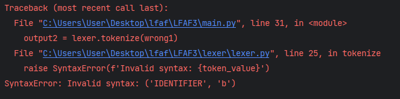
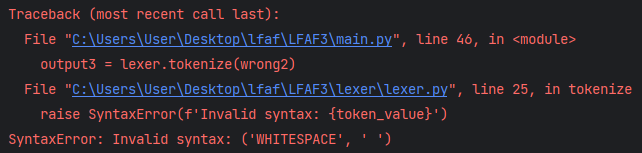

# Topic: Lexer & Scanner
## Course: Formal Languages & Finite Automata
### Author: Racovcena Irina
____
## Theory Notations
### What is a Lexer?

Lexers are commonly used in compilers, interpreters, and other programs that need to analyze or manipulate textual data.
It is basically a program or a software component that analyzes a sequence of characters in a text to produce a sequence 
of tokens (or lexemes) that can be used further.

Lexers typically use regular expressions and finite automata to recognize and classify tokens. Regular expressions are patterns that define the structure of the lexemes in the language, while finite automata are state machines that can recognize those patterns.

The lexer usually works in a two-pass process. In the first pass, 
it identifies all the tokens in the input text and builds a symbol table, 
which is a data structure that stores information about each token, such as its 
type and location in the source code. In the second pass, the symbol table is used 
to generate intermediate code or machine code.

### What is Lexer used for?

The main task of a lexer is to take the input text and break it down into a stream of tokens that can be used by the parser. Each token represents a unit of meaning in the text, 
such as a keyword, an identifier, a number, a symbol, or a string literal.

The lexer plays a crucial role in the compilation process by breaking down the input text into 
manageable units that can be further processed by the compiler or interpreter.

## Objectives:
1. Understand what lexical analysis [1] is.

2. Get familiar with the inner workings of a lexer/scanner/tokenizer.

3. Implement a sample lexer and show how it works.

## Implementation description
 
The first step consisted of creating a separate class for tokens which I could access and use
later in lexer:

```
class Tokens:
    token_patterns = {
        'FUNCTION': r'function',
        'NUMBER': r'\d+(\.\d+)?',
        'STRING': r'"[^"]*"',
        'LEFT_PAREN': r'\(',
        'RIGHT_PAREN': r'\)',
        'LEFT_BRACE': r'\{',
        'RIGHT_BRACE': r'\}',
        'COMMA': r',',
        'ASSIGN': r'=',
        'END': r';',
        'PLUS': r'\+',
        'MINUS': r'\-',
        'MULTIPLY': r'\*',
        'DIVIDE': r'\/',
        'MODULUS': r'\%',
        'GREATER': r'>',
        'GREATER_EQUAL': r'>=',
        'EQUAL': r'==',
        'LESS': r'<',
        'LESS_EQUAL': r'<=',
        'NOT_EQUAL': r'!=',
        'IF': r'if',
        'ELSE': r'else',
        'WHILE': r'while',
        'FOR': r'for',
        'RETURN': r'return',
        'BREAK': r'break',
        'CONTINUE': r'continue',
        'VARIABLE_DECLARATION': r'var',
        'WHITESPACE': r'\s+',
        'IDENTIFIER': r'[a-zA-Z_]\w*',
    }

    def __init__(self, name, pattern):
        self.name = name
        self.pattern = pattern
```

The second step was to make the actual lexer. I access the tokens 
from the Token class, so I can use them for tokenize() method next:

```commandline
class Lexer:
    def __init__(self):
        self.token_patterns = [Tokens(name, pattern) for name, pattern in Tokens.token_patterns.items()]
```

Now, let's move to the method which will check if the input corresponds to predefined
tokens. First, I'll check if they match:

```commandline
        while inputs:
            match = None
            for token in self.token_patterns:
                match = re.match(token.pattern, inputs)
                if match:
                    token_value = (token.name, match.group(0))
                    if token_value[0] != "WHITESPACE":
                        tokens.append(token_value)
                    inputs = inputs[len(token_value[1]):]
                    break

            if not match:
                raise SyntaxError(f'Invalid syntax: {token_value}')
```

This method iterates over the input string. For each iteration, 
the program searches for the first matching token pattern 
by iterating over a list of patterns stored in `self.token_patterns`. 
It uses the regular expression `re.match()` function to find a match 
between the current input string and the current token pattern. 
If a match is found, the program creates a tuple `token_value` 
consisting of the token name and the matched string, 
which is then appended to a list of tokens stored in the variable `tokens`.

If the matched token is a whitespace, it is ignored, and 
the program moves on to the next iteration. Otherwise, it is appended to the tokens list, and the input string is updated
by excluding the matched substring using slicing.

If no match is found, the program raises a SyntaxError.

## Conclusion

In conclusion, this was a valuable 
exercise in understanding the fundamentals of lexical 
analysis. In this laboratory, I managed
to implement all the theoretical notations on practice.

The process of designing and implementing the lexer also required careful 
consideration of the input language, as well as the expected 
output tokens. This involved testing and refining the lexer to 
ensure that it could accurately identify and tokenize all relevant 
parts of the source code.

This laboratory work provided a practical introduction to lexical 
analysis and the process of building a lexer from scratch. 
The skills and knowledge gained from this exercise can be applied 
to a range of applications, including the development of programming 
languages and other natural language processing tasks that require the 
analysis and manipulation of text.

## Results

The first input:
```commandline
function gcd(a, b) {
    if b == 0{
        return a;
    else {
        return gcd(b, a % b);
    }
    }
    }
```

The output:


The second input:

```commandline
function gcd(a, b) {
    if b! == 0{
        return a;
    else {
        return gcd(b, a % b);
    }
    }
    }
```

The output:



It gave an error because there's no such token that would allow typing `b!`.

The third input:
```commandline
function gcd(a, b) {
    if b == 0{
        return a;
    else {
        return gcd(b, a # b);
    }
    }
    }
```

The output:



It gave an error because there's no such token as `#`.